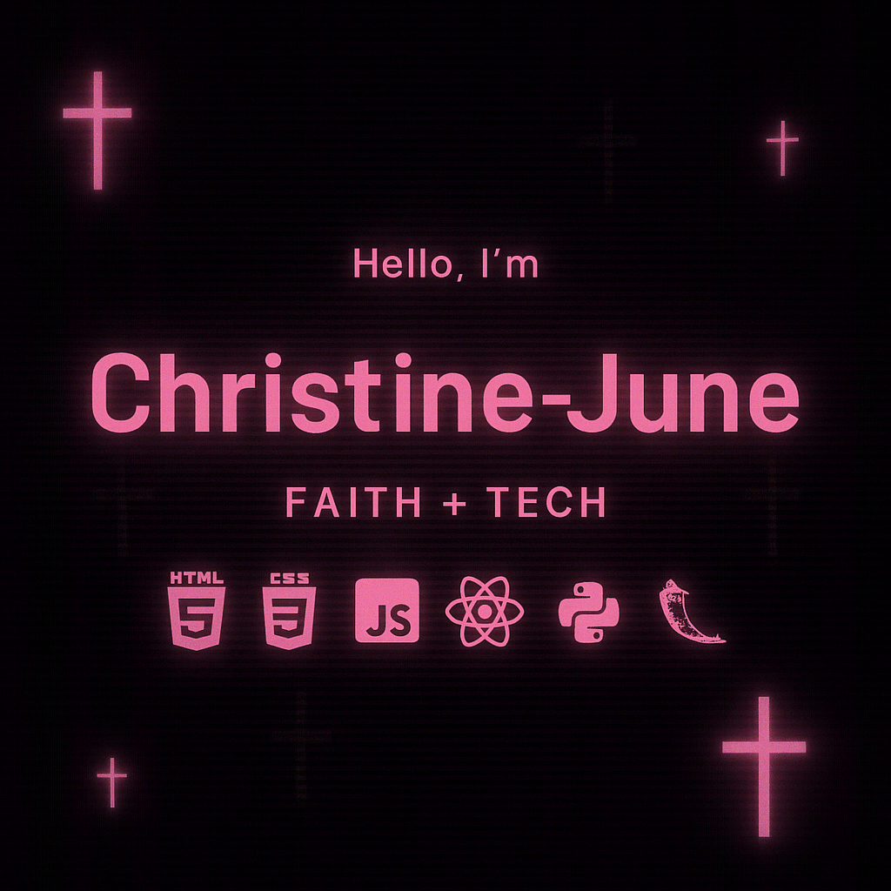

  

<h1 align="center">Welcome to Christine's Github</h1>
<h3 align="center">🚀 Full Stack Developer | Python + React Dev | Tech School Student</h3>

  

---

### 💻 Who is Christine

> Well,  
> I’m Christine June — a purpose-driven Full Stack Developer in training.  
> I build sleek UIs and expressive backends while vibing to faith, focus, and finesse.

⚡ Fun Facts  
✝️ Believer living by purpose  
🎮 Gamer at heart  
🤝 Ambivert — I love deep convos and focused code sprints  
💻 Always learning — currently diving deep into Flask  
❤️ Loves clean code, simple design, and helping others grow  

---

### 🛠️ My Tech Stack

Front-End  

  

Back-End + Tools  

  

---

### 🔥 Currently Working On

🛠️ Flask APIs & Full-Stack Projects  
🎨 Responsive UI with React + Tailwind  
🧪 Building real-world dev experience  
💼 Growing my GitHub & portfolio  

---

### 🤝 Connect With Me

  

---

### 🧠 Verse I Live By

"Romans 8:28"  
— My Sword / My Bible

  

